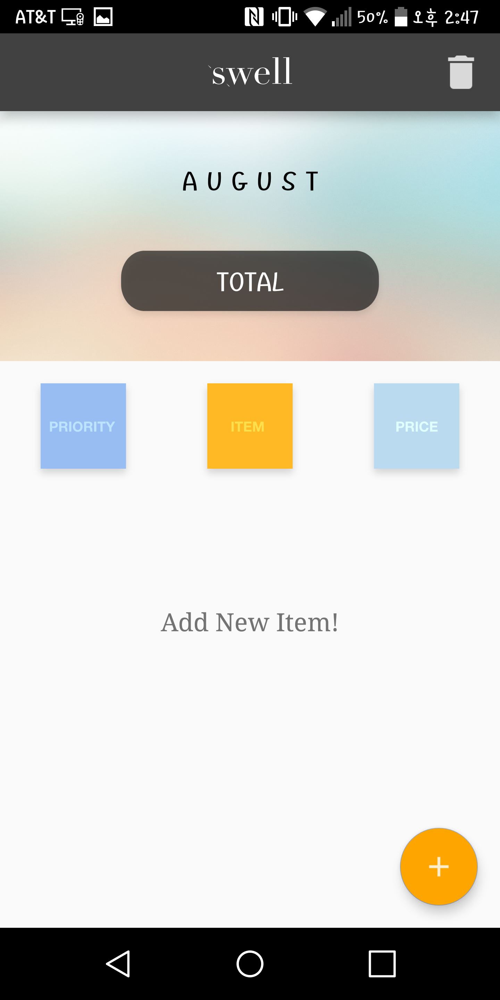

# About Swell

Swell started with the idea of "Spend well" to prevent unnecessary spending. 
Most of people use ledger to keep track of their expenditures.  
The problem is they already spent on something even if it might not be necessary.  
That is why I wanted to prevent impulsion buying before they spend by setting priorities. 

Swell is a budget planner with priority of items and simple design to catch eyes.  
App Swell lets you save money by giving information about the most or least priority you need to spend.  
These features help to think your spending habit by keeping track of expenditure.  
Total on the main screen shows the total amount of all the items automatically when you add item.  

I hope users can minimize unnecessary items by seeing the total amount displayed on the main screen.  
(Currency symbol will be automatically changed depending on where you live.) 

  

### Features of Swell

   • Simple to use.

   • Users can keep track of spending.

   • Priority allows users think again before they buy items.

   • Month will be automatically updated every month.

  

## ScreenShots

  
     

  

# License

The MIT License (MIT)

Copyright (c) 2016 Spark

Permission is hereby granted, free of charge, to any person obtaining a copy
of this software and associated documentation files (the "Software"), to deal
in the Software without restriction, including without limitation the rights
to use, copy, modify, merge, publish, distribute, sublicense, and/or sell
copies of the Software, and to permit persons to whom the Software is
furnished to do so, subject to the following conditions:

The above copyright notice and this permission notice shall be included in all
copies or substantial portions of the Software.

THE SOFTWARE IS PROVIDED "AS IS", WITHOUT WARRANTY OF ANY KIND, EXPRESS OR
IMPLIED, INCLUDING BUT NOT LIMITED TO THE WARRANTIES OF MERCHANTABILITY,
FITNESS FOR A PARTICULAR PURPOSE AND NONINFRINGEMENT. IN NO EVENT SHALL THE
AUTHORS OR COPYRIGHT HOLDERS BE LIABLE FOR ANY CLAIM, DAMAGES OR OTHER
LIABILITY, WHETHER IN AN ACTION OF CONTRACT, TORT OR OTHERWISE, ARISING FROM,
OUT OF OR IN CONNECTION WITH THE SOFTWARE OR THE USE OR OTHER DEALINGS IN THE
SOFTWARE.
